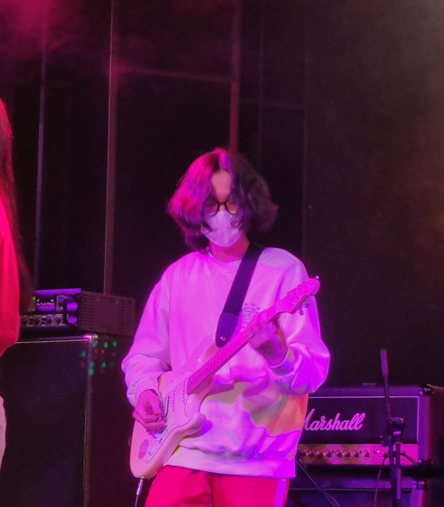

# 박건택, Park Geontaek
### **매일 성장하는 개발자 되기**
### 😎Personality 
- 생일 : 1997년 5월 13일 
- MBTI : INTP
- 성격 : 집돌이, 낯 가림
- 취미 : 기타, NETFLIX, YOUTUBE
- 좋아하는 음악 : 밴드음악, J rock, 윤하
- 좋아하는 음식 : 초밥, 햄버거

---
### 📖Career 
- 전자전기공학 (Major in Electronics) (2017.03~2023.08)
- Onsemi 공정기술 (2023.04~2023.11)
- SSAFY 11기 JAVA반  (2024.01~)
---

### ⭐ETC
- 기억에 남는 수업 : 자료구조
- 왜 개발자가 되고 싶은지
  - 다니던 회사 업무가 맞지 않았고, 학교에서 프로그래밍 수업이 재미있었다. 개발자에 대한 동경(?)이 있었고 성향이 잘 맞을것이라 생각했다.
- 매일 조금씩 성장하는 개발자 되기
- 멀티캠퍼스 도보 10분거리 자취중 (이사 예정..)
- 싸피에서 하고 싶은 것
  - 알고리즘 스터디를 하며 A+취득 & 친구 만들기
- 포부 : 열심히 해서 꼭 취뽀 하겠습니다

 

