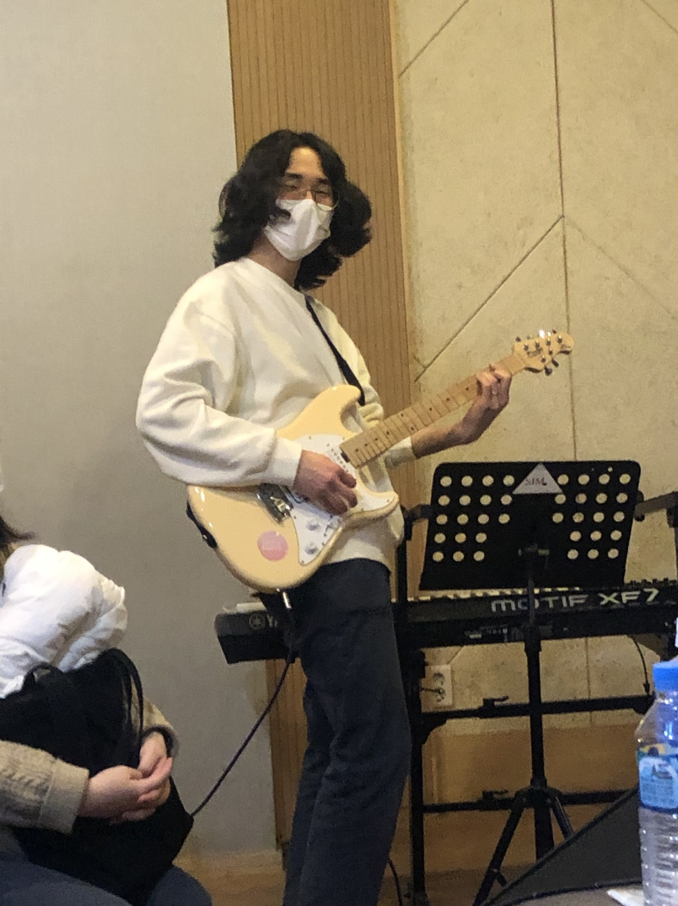

# 박건택, Park Geontaek
### **매일 성장하는 개발자 되기**
### 😎Personality 
- 생일 : 1997년 5월 13일 
- MBTI : INTP
- 성격 : 집돌이 
- 취미 : 기타, NETFLIX
- 좋아하는 음악 : 윤하, 밴드음악, J rock
- 좋아하는 음식 : 초밥, 햄버거

---
### 📖Education 
- 홍익대학교 전자전기공학 (Major in Electronics) (2017.03~2023.08)
- SSAFY 11기 JAVA반  (2024.01~)
---
### 🎈Goal 
- SW 알고리즘 A형 취득
- 취뽀 하기
---
### ⭐ETC
- 기억에 남는 수업 : 자료구조
- 백준 티어 아직 없음...

 

